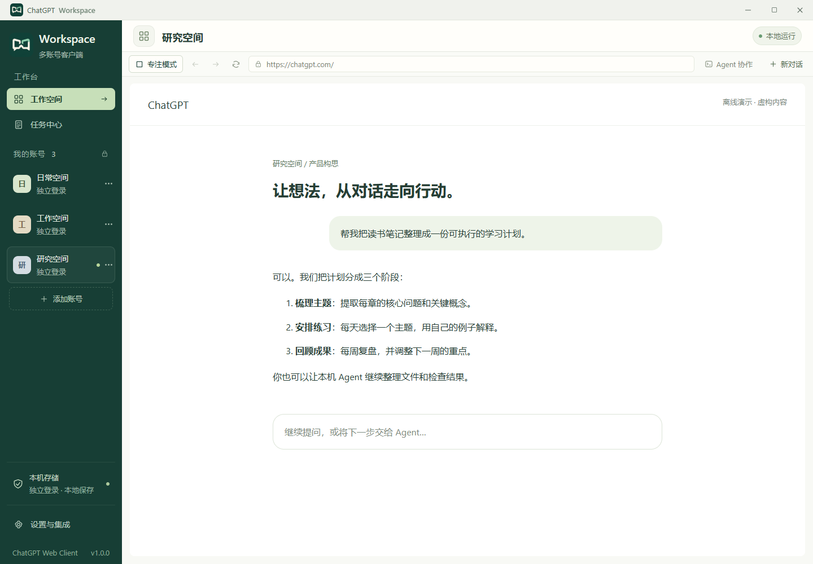
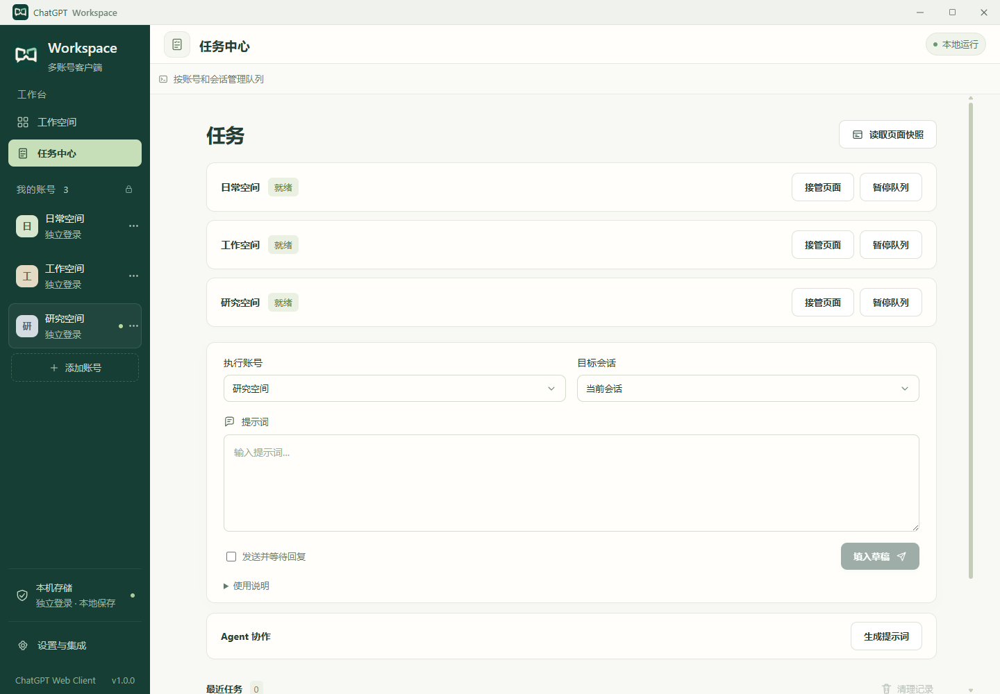
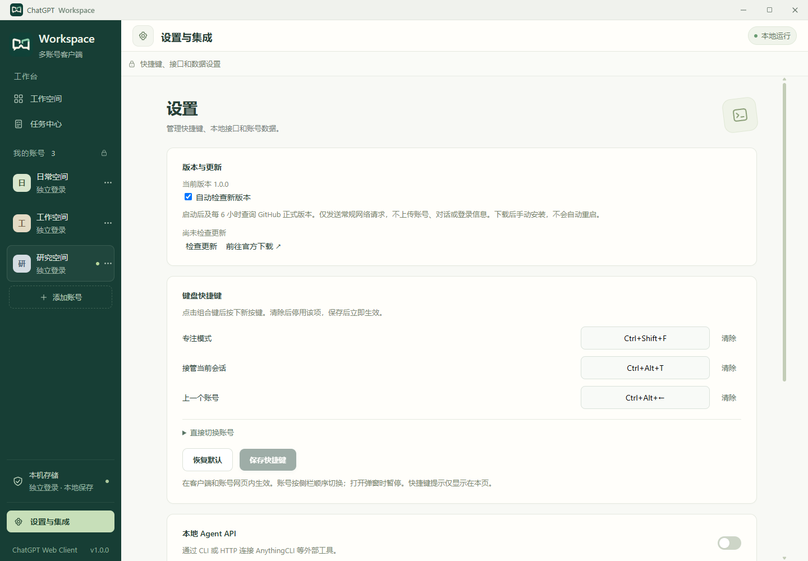

# ChatGPT Web Client

基于 Electron 的 ChatGPT 多账号桌面客户端，支持独立登录、会话恢复、本地任务与 HTTP / CLI 接口。

<p align="center"></p>

<p align="center"><a href="https://github.com/chenziyang110/ChatGPT-Web-Client/releases/latest">下载最新正式版</a> · <a href="docs/AGENT_COLLABORATION.md">Agent 协作指南</a> · <a href="docs/API.md">API 与 CLI</a></p>



> 图片使用独立临时环境、虚构账号和离线演示对话制作；不含真实账号、聊天记录、邮箱或登录信息。网页区域为演示内容，实际 ChatGPT 页面可能不同。

## 下载与开始

**当前正式版 v1.2.0**：前往 [Releases](https://github.com/chenziyang110/ChatGPT-Web-Client/releases/latest)，按下表选择系统和 CPU 对应的安装包。

1. 添加账号，在独立的 ChatGPT 网页中自行登录。
2. 添加其他账号，在侧栏随时切换；各账号的登录状态互相隔离。
3. 在任务中心准备提示词，或通过 **Agent 协作** 让本机 Agent 获取网页回复。

Windows 安装包尚未配置发布者签名，可能显示未知发布者提示。请核对来源与 Release 附带的 SHA-256。v1.2.0 提供以下六种系统 / CPU 组合的安装包。

| 系统 | x64（Intel / AMD） | ARM64 | 安装包 |
| --- | --- | --- | --- |
| Windows | 支持 | 支持 | NSIS `.exe` |
| macOS | Intel Mac | Apple Silicon（M 系列） | `.dmg`、`.zip` |
| Linux | 支持 | 支持 | `.AppImage`、`.tar.gz` |

macOS 包使用 ad-hoc 签名，尚无 Developer ID 签名及公证；首次打开请参考 [macOS 安装说明](docs/MACOS.md)。Linux AppImage 可能需要 FUSE，也可使用 tar.gz 解压版。跨架构构建通过不等于目标硬件运行验证。

## 能做什么

| 功能 | 使用方式 |
| --- | --- |
| 多账号独立登录 | 最多 20 个账号，各自保存 Cookie、存储和会话，支持重命名与删除 |
| 恢复工作空间 | 重启后恢复账号、页面位置和窗口状态 |
| 低内存后台页 | 安全休眠闲置会话，保留标签并在切回时自动恢复 |
| 老板键 | 在系统全局用 `Ctrl+Shift+S`（macOS 为 `⌘+Shift+S`）隐藏或唤回窗口 |
| 专注模式 | 隐藏侧栏，保留账号切换和网页工具栏；快捷键可自定义 |
| 回复完成提醒 | 账号显示生成状态和未处理会话数量，支持逐项查看与标记 |
| 任务中心 | 准备提示词、明确发送、等待回复、查看任务和页面快照 |
| 安全接管 | 遇到登录、验证、已有草稿或发送状态不明时暂停，由你处理 |
| 并行协作 | 同一会话按顺序执行，不同会话最多两个自动任务并行 |
| Agent 接口 | 本地 HTTP、JSON CLI 和 Windows Go 工具；支持流式输出、断线续读与防重发 |
| 新版通知 | 启动后及每 6 小时检查正式版本，侧栏提醒，设置中可手动检查或关闭 |

### 任务有进度，也能随时接管



任务默认只准备草稿；明确选择发送才会提交。发送结果不明确时暂停核对，避免重复提交。重启后队列保持暂停，普通任务记录最多保留 200 条，未处理任务优先保留。

### 设置、快捷键与版本更新



更新检查仅请求 GitHub 的公开发布信息，不上传账号、对话、Cookie 或本地 API 令牌。GitHub 会像普通网络访问一样收到 IP 地址等连接信息。发现新版本后，点击前往本仓库 Release 下载并手动安装；不静默下载、不强制重启。检查失败会显示可重试状态，不影响日常使用。

**更新通知从 v1.0.0 开始生效**。更早的开发版本需要先手动安装本版。覆盖安装前退出客户端，保留原有用户数据目录；不要在卸载时选择清除数据。

## 运行

### 快捷键

| 操作 | Windows / Linux | macOS |
| --- | --- | --- |
| 老板键：隐藏 / 显示到前台（全局） | `Ctrl+Shift+S` | `⌘+Shift+S` |
| 进入 / 退出专注模式 | `Ctrl+Shift+F` | `⌘+Shift+F` |
| 切换到侧栏第 1–9 个账号 | `Ctrl+Alt+1…9` | `⌘+Option+1…9` |
| 上一个 / 下一个账号（首尾循环） | `Ctrl+Alt+← / →` | `⌘+Option+← / →` |

老板键在系统全局生效；其余快捷键在客户端和账号网页输入框内均可使用，打开弹窗时暂停。第 10 个及之后的账号可通过循环快捷键或专注模式的账号选择框访问。

### 启动应用

开发构建需要 **Node.js 24+**、npm、**Go 1.24+** 和可运行 Electron 的桌面系统。安装后的 Go Agent 工具在三种系统均无需 Node.js。

```sh
npm ci
npm run dev
```

渲染界面支持热更新；修改主进程/preload 后请重新启动开发命令。构建后运行：

```sh
npm run build
npm start
```

添加账号后，在它的 ChatGPT 网页中自行登录。应用不要求粘贴账号密码。任务中心默认只填写草稿，勾选发送后才提交给 ChatGPT。在设置中启用“本地 Agent API”后，外部工具才能连接。

```sh
node dist-electron/cli.cjs accounts
node dist-electron/cli.cjs browser inspect --account <account-id>
node dist-electron/cli.cjs snapshot <account-id>
node dist-electron/cli.cjs conversations add --account <account-id> --url https://chatgpt.com/c/<id> --alias daily
node dist-electron/cli.cjs prompt --account <account-id> --conversation daily --text "总结当前主题" --submit --wait --idempotency-key summary-001
node dist-electron/cli.cjs --help
```

Agent 首选原生 Go 工具（开发版位于 `dist-agent/`；v1.1.0 安装版位于应用的 `resources/agent/`，macOS 为 `.app/Contents/Resources/agent/`）。macOS / Linux 文件名为 `chatgpt-agent`，Windows 为 `chatgpt-agent.exe`：

```powershell
.\dist-agent\chatgpt-agent.exe ask --account <account-id> --new --text-file question.txt --stream
.\dist-agent\chatgpt-agent.exe resume <task-id> --stream
```

默认一直等待完整回复，`--stream` 逐行返回 JSON 事件，只有 `done` 表示完成。请求发送前自动保存，断线重连沿用原任务；中断后 `resume` 续读，不重复发送。

开发时也可使用 `npm run cli -- accounts`。`--data-dir PATH`（放在命令前）或 `WORKSPACE_USER_DATA` 指定与桌面端相同的数据目录。完整用法见 [docs/API.md](docs/API.md)。

## 让 Agent 借助网页 ChatGPT

1. 在目标账号的网页中登录，选好希望咨询的模型，并启用本地服务。
2. 点击网页工具栏的 **Agent 协作**，或账号管理里的 **生成 Agent 提示词**。任务中心也可按所选账号和会话生成。
3. 选择范围并复制提示词，连同你的具体任务交给能在本机运行命令或访问本地接口的 Agent。
4. Agent 调用提示词中的 原生 `chatgpt-agent` 工具，工具负责发送、阻塞等待、流式输出和断线续读，Agent 拿到完整回答后验证建议并继续原任务。执行时可看只读实时预览；遇到草稿、登录或验证时，界面让你选择接管处理、继续原任务或取消。

选择账号会在首次咨询时新建会话，后续追问沿用它；选择会话会固定目标，之后切换网页不影响提示词中的目标。生成和复制不会发送消息，也不会自动开启服务。模型由网页设置决定，提示词不能将账号升级或自动切换到高级模型。

完整说明见 [Agent 协作](docs/AGENT_COLLABORATION.md)。

## 数据与权限

| 系统 | 默认数据目录 |
| --- | --- |
| macOS | `~/Library/Application Support/ChatGPT-Web-Client` |
| Windows | `%APPDATA%/ChatGPT-Web-Client` |
| Linux | `$XDG_CONFIG_HOME/ChatGPT-Web-Client`，未设置时为 `~/.config/ChatGPT-Web-Client` |

`workspace.sqlite` 保存账号、会话、任务及设置；Electron 在独立的 `Partitions/account-<uuid>` 目录保存浏览器资料。删除账号会清除浏览器存储、缓存、HTTP 鉴权和该账号任务记录。

网页没有 Node.js、preload 或 IPC 权限。本地界面使用独立分区，IPC 校验发送者、主 frame 和精确 URL。API 默认关闭，仅监听 `127.0.0.1`，操作接口要求随机令牌并拒绝浏览器 Origin/Fetch Metadata 与非预期 Host；help.html / help.json 是不含私密数据的公开本机说明页。

启用 API 后的 `agent-runtime.json` 包含地址及令牌，关闭时删除，每次启动轮换。POSIX 下文件权限为 `0600`、数据目录为 `0700`；Windows 使用用户配置目录的 ACL。同一系统用户下能访问这些文件的进程仍属于信任边界。不要上传或提交浏览器资料、数据库和连接配置。

任务输入和结果仅保存在本机，可在任务中心清空。防重发用的最小请求键、摘要与任务 ID 会保留到删除账号；升级前备份可能包含旧任务内容。显式发送的内容会进入 ChatGPT 服务。本项目不暴露任意 JavaScript、shell 执行或 Cookie 导出接口。

## 测试与打包

```sh
npm test                 # 核心、持久化、HTTP 和 CLI
npm run build            # 类型检查与全部编译产物
npm run test:desktop     # 真实 Electron，离线页面 fixture，需要桌面显示
npm run pack             # 当前平台的应用目录
npm run dist             # 当前系统、当前架构
npm run dist:win         # Windows x64 + ARM64
npm run dist:mac         # macOS x64 + ARM64（在 Mac 上运行）
npm run dist:linux       # Linux x64 + ARM64（建议在 Linux 上运行）
npm run build:agent:all  # 交叉编译六种原生 Agent
```

Linux 无头测试：`xvfb-run --auto-servernum npm run test:desktop`。一次性 CI 测试程序使用 `--no-sandbox`；正式应用保持沙箱。GitHub Actions 配置了三平台检查/打包和 Linux 桌面测试。发布矩阵覆盖三个系统的 x64 / ARM64；代码签名、公证和发布凭据不在仓库中。更新采用公开 Release 检查与手动下载安装。发布流程见 [发布指南](docs/RELEASING.md)。

## 已知边界

- ChatGPT 登录、订阅、验证码、网络可用性由对应服务决定。第三方 OAuth 可能拒绝嵌入式浏览器；本项目不绕过服务限制。
- 第一阶段只支持普通个人会话；会话列表是本地登记记录，批量导入、项目/GPT/临时会话、完整云端历史同步暂未实现。
- 提示词自动化依赖 ChatGPT 的 DOM 属性。网页变化、工具调用或慢回复可能导致失败/超时。取消或超时不会撤回已经发送的内容，也不保证停止网页端生成。
- 麦克风、摄像头等网页权限默认关闭。下载通过原生保存对话框处理。最多 20 个账号；打开的账号会占用各自的 Chromium 资源。
- AnythingCLI 的集成方式是标准子进程 CLI 或 HTTP，没有假设其未公开的原生插件协议。
- MCP、插件生态和多服务商是需求文档中的后续扩展。

详见 [架构](docs/ARCHITECTURE.md)、[路线](docs/ROADMAP.md) 和 [验证记录](docs/VALIDATION.md)。本项目独立开发，与 OpenAI 无隶属关系。

## 账号会话通知与快捷键

账号头像旁的转圈表示该账号的会话正在生成回复；消息气泡按未处理的会话数计数。同一会话连续完成多轮仍计 1 个，不同会话分别累加。运行和待处理气泡可以同时显示。点击气泡可查看列表，打开对应会话或逐项标记已处理；切换账号不会直接清空所有气泡，未处理状态在重启后保留。

通知覆盖客户端中已打开的账号页面（包括切到其他账号后的后台页面）和任务队列。打开历史对话不会产生新通知。不监控外部浏览器或尚未打开的云端会话；在同一账号内导航离开正在生成的页面后，原页面的完成状态无法继续观察。结束判断依赖已支持的网页完成标记，错误和未知状态不会当作完成。

侧栏、账号按钮提示和专注模式按钮不显示快捷键组合。进入“设置与集成 → 键盘快捷键”可录入、清除或恢复默认，保存后立即对主界面和账号网页生效，重启保留。重复绑定会阻止保存；快捷键只在应用内生效。

执行期间点击 **接管**，客户端会先停止本地自动操作，再交还网页控制权；设置中可配置接管快捷键。尚未发送的任务可处理后继续，已经发送或结果不确定的任务需核对，不会重复发送。
