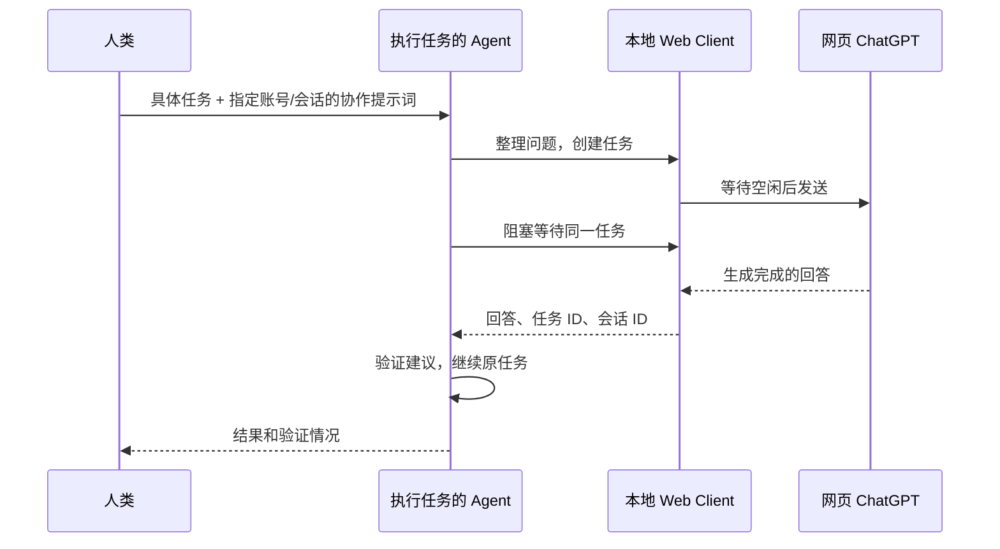

# Agent 协作

人类把具体任务和客户端生成的提示词交给本机 Agent。Agent 遇到需要更多分析的问题时，可以向指定的 ChatGPT 网页会话咨询，取回回答后继续工作。

## 使用入口

- 账号管理 → **生成 Agent 提示词**：默认指定该账号，首次咨询新建会话。
- 网页工具栏 → **Agent 协作**：当前是支持的普通会话时，默认固定它的链接；首页默认指定账号。
- 任务中心 → **给 Agent 的提示词**：沿用执行账号和目标会话的选择。

弹窗可以更换协作账号和范围，预览后复制。服务未启用时可在弹窗中手动开启。生成和复制不创建任务、不发送问题、不读取服务令牌；复制时使用预览已解析的目标，不重新定位“当前会话”。

| 范围 | 首次提问 | 后续追问 |
| --- | --- | --- |
| 指定账号 | 固定账号 UUID，创建新咨询会话 | 保存并复用返回的 conversationId |
| 指定会话 | 固定账号 UUID 和会话 ID 或规范链接 | 在同一 conversationId 中继续 |

示例交给 Agent 的任务：

> 请修复当前项目的测试失败。先检查原因；遇到不确定的设计或边界问题，按下面的协作提示词咨询网页 ChatGPT。拿到建议后请验证、修改并运行相关测试，最后告诉我结果。

将客户端复制的完整提示词接在后面即可。执行 Agent 只向网页发送业务问题和必要背景，不转发本地连接说明。

## Agent 获得什么

提示词包含固定目标、原生 Go 工具的绝对路径及参数数组和本机 help.html 链接。Agent 直接调用 `chatgpt-agent ask`（Windows 文件名为 `chatgpt-agent.exe`），无需自己发送 HTTP 请求或安装 Node.js。工具会保存请求、提交一次并一直等待完整回答。默认不加 `--stream`，不创建定时监控目标，也不轮询 `tasks.get`；若工具返回“进程仍在运行”，应对同一进程使用最长等待。只有 `done` 表示完成。

- CLI 用 `--text-file` 读取 UTF-8 问题文件，避免复杂代码、引号和换行参与 shell 解释。
- HTTP 从本机 `agent-runtime.json` 读取当前地址和令牌，提交 `tasks.create`，通过 `tasks.wait` 长轮询同一任务，从完成任务的 `result.response` 取回答；禁止高频 `tasks.get`。
- 每个新问题保存独立请求键。等待超时继续查原任务；创建响应丢失仅以同键、同参数重试。
- `waiting_user` 时只通知用户一次并保持原进程；用户处理后点击「交还 Agent 并继续」，原等待会自动恢复，不应标记为 blocked。`uncertain` 时只读核验原问题并等待答案，不能重发、自动接管或确认恢复。
- 工具中断后使用 `resume TASK_ID`；若未收到任务 ID，使用 `resume --request-file 已保存的请求文件`。请求键和完整参数自动保存，重连使用原请求。
- 遇到页面错误先调用 `browser inspect --account ID`（或 `browser.inspect`），区分加载中、需要网页验证、需要登录和输入框就绪。它不进入发送队列，暂停时仍可检查，且不会发送或恢复任务。
- 回答只是建议。执行 Agent 仍需按原任务授权检查事实、验证代码和运行适当测试。

生成接口为 `agent.prompt`，CLI 为 `agent-prompt`；字段与命令见 [API](API.md)。账号/会话名称只是标签，实际调用使用稳定标识。

## 使用条件与边界

执行 Agent 必须能访问运行客户端的这台机器，并具备文件、子进程或 HTTP 工具。只有聊天文本能力的机器人不能直接访问本地服务。客户端需持续运行，目标账号需已登录且具备所选网页模型的使用权限。模型由人类在网页预先选择；服务不保证模型等级或自动切换模型。

目前支持普通个人会话，列表来自本地登记和访问记录。项目、自定义 GPT、临时会话及完整云端历史同步不在本阶段范围内。同一会话的任务按队列串行；不同会话可并行，包括同一账号的不同会话。全局最多两个自动任务同时运行，不包含人类正在使用的网页会话。

提示词不含登录凭据或服务令牌；调用时令牌只用于本机鉴权。**目标范围是协作约定，不是权限隔离令牌**：当前本地 API 令牌拥有整个工作空间已有接口的权限，能够读取该配置文件的本机进程属于信任边界。如果将来需要向不可信 Agent 只开放某个会话，应另行实现限定目标和操作的授权令牌。

生成与复制已经通过离线验证；真实 ChatGPT 的登录、订阅权限、限流和网页变化仍可能影响执行。任务中心会保留实际状态，不能把“入队成功”当成“已得到回答”。

网页文档加载完成后，输入框仍可能继续初始化。客户端会等待最多 30 秒再报告页面未就绪；若网页要求验证，需要人类在对应账号页面完成。诊断显示 `ready` 只代表输入框可用，不能证明已切换 Pro；目前仍需人类在网页选模型。

## 预览、等待与接管

执行时显示每秒更新的只读网页画面，点击、输入不会传给网页。出现草稿、登录、验证或页面未就绪时，任务保留为 `waiting_user`，界面显示具体原因和处理选项。

- **接管**：暂停当前会话队列，等待该会话的自动操作停止后交还网页。可以处理已有草稿、登录或验证。
- **交还 Agent 并继续 / 处理好了，继续 / 再试一次**：恢复同一条尚未发送的任务，保留目标、问题、请求键和正在等待的 CLI 进程。
- **取消任务**：取消尚未发送的任务。
- **已核对，结束此任务**：仅适用于消息可能已发送的情况；不会重发。后续队列保持暂停，可另行继续。

接管也支持应用内快捷键，可在设置中配置；组合不显示在工作区。接管不会撤回已发送消息，也不保证网页停止生成。Agent 保持同一任务的阻塞等待，并只在人类需要选择时通知一次。

`GET /help.html` 和 `GET /help.json` 可直接阅读，不含账号数据或令牌。操作接口仍需要本机令牌。帮助链接只能在运行客户端的设备访问；重启后端口变化，应根据 discoveryFile 更新链接。
