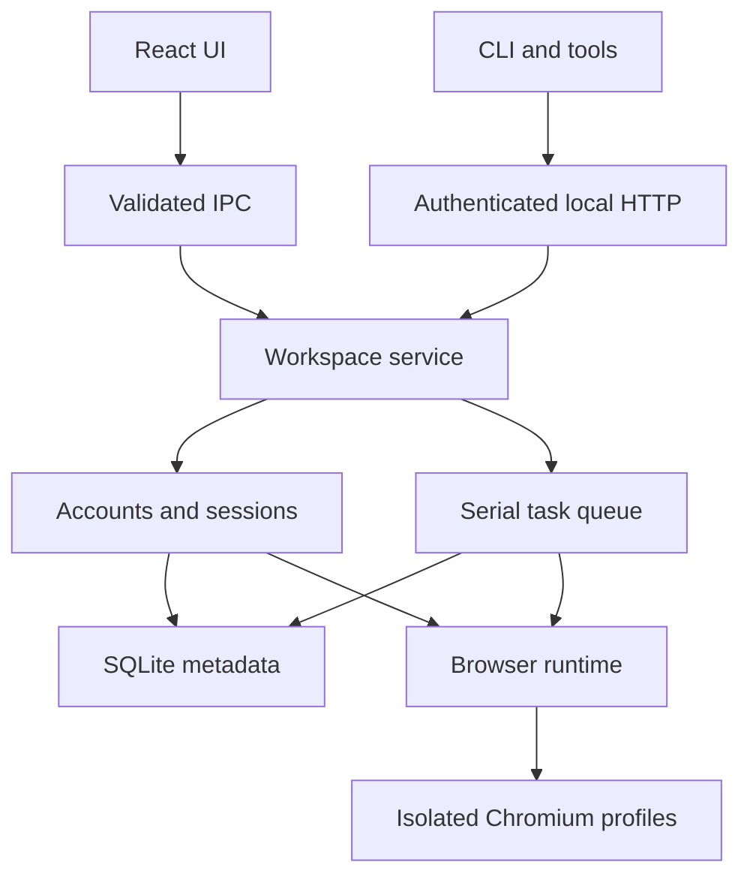

# Architecture

React provides a local control plane. Each account website lives in a separate sandboxed `WebContentsView`, with no preload or Node access. Persistent Chromium partitions are derived from generated UUIDs; callers cannot select arbitrary profile paths.

- `src/shared`: serializable contracts, no Electron imports.
- `src/core/storage`: Node 24 built-in SQLite, WAL and atomic metadata transactions; no native addon ABI rebuild.
- `src/core/account`, `session`: persistent accounts, active account, page URLs and window bounds.
- `src/core/agent`: bounded queue, results, cancellation, crash recovery and token-protected HTTP transport.
- `src/core/Workspace.ts`: validated shared dispatcher with serialized mutations.
- `src/main`: lifecycle, trusted IPC sender checks, partitions, navigation policy and fixed DOM task functions.
- `src/renderer`: account management, native view visibility, task UI and settings.
- `src/cli`: private discovery-file client, stable JSON output.

Startup takes a single-instance lock before opening SQLite. Shutdown stops API admission, settles commands, cancels tasks, saves window state, closes account views and then SQLite. Interrupted tasks are never replayed. OAuth stays in the same account partition; external HTTPS links require user confirmation before opening the system browser. Popups receive the same isolation policy.

IPC validates the sender webContents, main frame and exact local URL. Remote content receives no bridge. Browser task functions are fixed source with JSON-serialized arguments. Snapshot/task results may contain conversation content; they stay in the local database or authenticated response.
