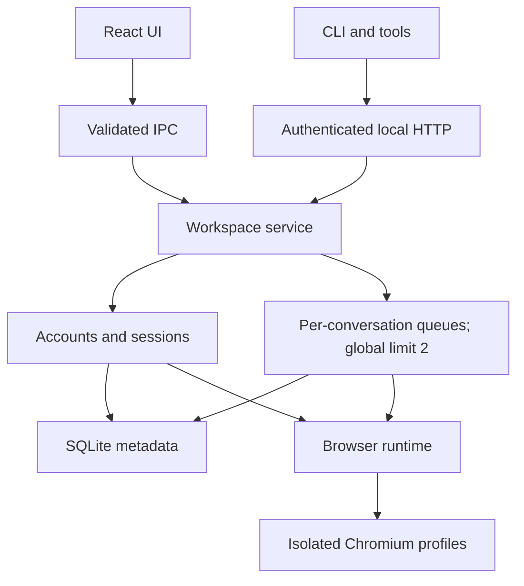

# Architecture

React provides a local control plane. Each opened conversation lives in a separate sandboxed `WebContentsView`; conversations belonging to one account share its login partition, with no preload or Node access. Persistent Chromium partitions are derived from generated UUIDs; callers cannot select arbitrary profile paths.

- `src/shared`: serializable contracts, no Electron imports.
- `src/core/storage`: Node 24 built-in SQLite, WAL and atomic metadata transactions; no native addon ABI rebuild.
- `src/core/account`, `session`, `conversation`: persistent accounts, active account, page URLs and window bounds.
- `src/core/agent`: bounded queue, results, cancellation, crash recovery and token-protected HTTP transport.
- `src/core/Workspace.ts`: validated shared dispatcher with serialized mutations.
- `src/main`: lifecycle, trusted IPC sender checks, partitions, navigation policy and fixed DOM task functions.
- `src/renderer`: account management, native view visibility, task UI and settings.
- `src/cli`: private discovery-file client, stable JSON output.

Startup takes a single-instance lock before opening SQLite. Shutdown stops API admission, settles commands, cancels tasks, saves window state, closes account views and then SQLite. Startup restores pending work paused; legacy tasks without pinned targets fail safely. Send intent marks uncertain outcomes that are never automatically replayed; only pre-send waiting_user work can retry after a desktop decision. OAuth stays in the same account partition; external HTTPS links require user confirmation before opening the system browser. Popups receive the same isolation policy.

IPC validates the sender webContents, main frame and exact local URL. Remote content receives no bridge. Browser task functions are fixed source with JSON-serialized arguments. Snapshot/task results may contain conversation content; they stay in the local database or authenticated response.

The schema-v2 migration creates a consistent SQLite backup before upgrading schema-v1 databases. Accounts and sessions remain in metadata; conversations, tasks, account queues and minimal idempotency records use separate indexed tables. Request hashes are scoped to account ID. Browser credentials remain solely in isolated Chromium profiles.

The ChatGPT adapter pins URLs and verifies message anchors before mutation. It distinguishes preparation, waiting for prior generation, send intent, submission acknowledgement and stable terminal replies. Each account keeps its execution lock until outstanding browser scripts settle, or its view is closed after a bounded cleanup timeout. Manual takeover pauses later work before releasing control. An unresolved first send marks the local new-conversation record uncertain so later tasks cannot silently create a different conversation.

Conversation notifications observe each live account view without adding a remote preload/IPC bridge. A 1.5 second monitor permits one outstanding read per page; its activity path reads only the latest user and assistant messages, while the task adapter retains full-history checks before mutation. Its core state machine baselines historical pages, watches generation, and requires three seconds of stable terminal reply state. It shares a reply fingerprint with submitted task results. SQLite stores one unread receipt per account/conversation and preserves it until acknowledged with the matching completion token or the exact unlocked conversation is visibly selected in the focused workspace. Hidden, background and Agent-locked views never consume receipts. Running indicators reset at startup. Observers stop before database shutdown.

An inactive ChatGPT tab with no draft, generation, or Agent lock is hibernated after one minute: its `WebContentsView` is closed to release the renderer and GPU surfaces while its tab metadata remains in the workspace. Selecting the tab recreates the isolated view at its saved URL. Active pages, in-progress replies, Agent-controlled pages, drafts, login flows, and pages that cannot be safely inspected are never hibernated.

Shortcut settings are validated and persisted in SQLite. Both the trusted renderer and isolated account views use the same current binding map through `before-input-event`; combinations are shown only in settings. The trusted renderer can temporarily suspend its shortcut dispatch while recording a binding, and that capture control is unavailable over HTTP.

Agent consultation handoffs are generated by the core `agent.prompt` read path and a pure `AgentPrompt` template. The resolver fixes an account UUID and an optional local conversation ID or canonical URL; it never creates a task, registers a new consultation, enables the API or reads its token. The renderer previews that resolved target and passes the same target to trusted `agent.prompt.copy` IPC. External Agents use the existing CLI/HTTP queue, result and idempotency contracts; there is no second executor or model-selection layer. Development handoffs include the built CLI path and actual data directory; packaged handoffs use HTTP directly. This scope is a prompt convention, while API authentication remains workspace-wide.

Read-only `browser.inspect` bypasses the mutation/dispatch queue and inspects only an existing account view with a fixed diagnostic operation. It returns readiness and limited metadata, not page/draft content or arbitrary JavaScript results. The adapter distinguishes document loading, composer hydration, login and verification gates; it waits for initialization before mutation and never attempts to solve a website challenge. Queue pause and duplicate-send safeguards remain independent of a ready diagnostic result.

Public static `/help.html` and `/help.json` are served before bearer/origin checks but after strict Host validation. They contain no interpolated account data, paths or token; their CSP disables scripts, connections and framing. Operational routes retain their original authentication and browser-request rejection.

Task attention is persisted with a random decision token and explicit choices. Trusted `tasks.decide` IPC serializes decisions with workspace mutations; external HTTP cannot call it. `waiting_user` and unresolved `uncertain` retain the account lock until takeover. Takeover aborts the executor, waits for pending browser scripts to settle, then persists human control. Retry is prohibited after send intent and cannot bypass other unresolved work.

The renderer never receives interactive website DOM. Trusted `browser.preview` IPC captures hidden account contents as bounded JPEG frames, with one capture in flight per account. The renderer polls only while displaying a locked account, cancels polling on unmount, and displays a noninteractive image. Native views and popups remain hidden and block input while locked. Shortcut migration preserves old custom bindings and leaves a new default unassigned if it conflicts.
