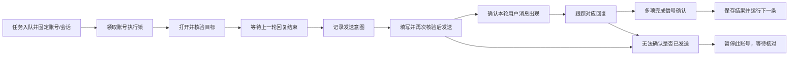

# 按账号与会话执行任务：调研与实施方案

调研日期：2026-09-16。状态：建议稿，命令和数据结构尚未实现。

## 1. 建议与目标

在现有 Electron 本地网页运行时上实现「账号独立队列、任务固定会话、发送前等待空闲、结果不确定时暂停」。第一期每个账号只运行一个网页任务，不同账号可并行，全局自动执行并发建议默认 2。

预期使用方式：选定账号和会话，连续加入多个提示词。系统确认上一轮回答完成后才发送下一条。用户切换账号不会改变已排队任务的目标。CLI、HTTP、桌面任务中心使用同一套任务服务和结果。

第一期优先支持普通文字会话。图片生成、语音、深度研究、工具审批、临时聊天、自定义 GPT/项目特殊路由及消息分支分别评估，不把普通文字的结束判断直接套到这些模式。

## 2. 现有实现：已核对的事实

| 位置 | 当前实现 | 对目标的影响 |
| --- | --- | --- |
| `src/shared/types.ts` | 任务只有 `accountId`，没有会话目标 | 执行时使用账号当时打开的页面 |
| `src/core/session/SessionManager.ts` | 每个账号保存一个最后 URL | 这是页面恢复信息，不是会话目录 |
| `src/main/BrowserRuntime.ts` | 每账号一个 `WebContentsView` | 同一账号同时操作两条会话会争抢页面 |
| `src/core/agent/AgentGateway.ts` | 一个全局串行队列，执行上限 120 秒 | 一个账号卡住会挡住其他账号；长回复可能提前超时 |
| `src/main/BrowserRuntime.ts` | 发送前未等待已有回复结束 | 手动发出的上一轮尚在生成时，自动发送可能失败 |
| `src/main/BrowserRuntime.ts` | 新增 assistant 元素、无停止按钮、短暂文字稳定后判完成 | 依赖页面结构，可能被中间输出、分支或页面变化误导 |
| `src/cli/index.ts` | `--wait` 从入队起最多等待 130 秒 | 在后面排队的任务可能还未开始，CLI 就已退出；任务仍可能继续 |
| `src/core/Workspace.ts` | 导航命令与任务队列分离，且所有变更共用一个 Promise 队列 | 直接导航可以打断执行；慢导航也可能阻塞其他账号的控制命令 |
| `src/core/agent/AgentGateway.ts` | 取消/超时结束本地等待，继续下一任务 | 网页端可能仍在生成，下一条不能假定已空闲 |

## 3. 外部调研与技术选择

以下事实来自公开主文档；表中取舍是针对本项目的设计建议。

| 路线 | 证据与边界 | 建议 |
| --- | --- | --- |
| 官方 Responses / Conversations API | 官方支持有持久 ID 的 API 会话对象；ChatGPT 与 API 单独计费。本次未找到直接读写 ChatGPT 网页历史会话的公开接口 | 将来可作为独立 API 模式；不能用它替代本次「继续网页账号已有会话」的需求。[会话状态](https://developers.openai.com/api/docs/guides/conversation-state)、[计费说明](https://help.openai.com/en/articles/9039756-billing-settings-in-chatgpt-vs-platform) |
| 现有 Electron 网页适配器 | Electron 支持页面控制、导航事件和按 partition 隔离；相同 partition 的多个页面可共享会话 | 推荐复用，登录资料留在本机。[WebContents](https://www.electronjs.org/docs/latest/api/web-contents)、[WebPreferences](https://www.electronjs.org/docs/latest/api/structures/web-preferences) |
| 独立 Playwright 浏览器运行时 | Playwright 的 Electron 支持仍标为 experimental | 继续用于测试，不为本需求另起浏览器或复制用户资料。[Electron 自动化](https://playwright.dev/docs/api/class-electron) |
| 通用 AI 浏览器代理 | Stagehand 提供 act / observe / extract 等能力 | 本次操作范围固定，不增加模型调用与自由决策；具体网页适配逻辑更容易测试。[Stagehand](https://docs.browserbase.com/welcome/quickstarts/stagehand) |
| 直接调用网页内部请求 | 本次未找到所需私有请求的公开、稳定接口契约 | 不作为正式实现依赖，不设计 Cookie/token 导出流程 |
| 队列库 | p-queue 提供并发控制，明确区分执行超时与排队等待 | 可借鉴调度语义，但持久化、会话锁、发送不确定性仍须自行实现。第一期沿用 SQLite 与现有队列，不引入 Redis。[p-queue](https://github.com/sindresorhus/p-queue) |

另有两个直接影响实现的事实：

- Electron 的页内导航事件不可取消，`will-navigate` 也不覆盖程序主动导航。因此仅拦截一个导航事件无法保证会话不变，必须在操作执行时再次验证目标。[导航事件](https://www.electronjs.org/docs/latest/api/web-contents#navigation-events)
- Playwright 不建议靠 `networkidle` 判断页面就绪。本方案也不把网络空闲当作 ChatGPT 回复完成；这是根据该文档及当前回复检测方式作出的工程判断。[等待状态](https://playwright.dev/docs/api/class-frame#frame-wait-for-load-state)

## 4. 用户操作规则

### 指定账号

- 账号 ID 是稳定标识；增加唯一的本地别名，方便写脚本，重名时拒绝猜测。
- 参数未指定账号时，交互界面可使用当前选择；无交互 CLI 必须显式指定或使用明确配置的默认账号。
- 账号别名在入队时解析成 ID，之后重命名或切换当前账号都不改变任务目标。

### 指定会话

- 使用本地会话记录：账号 ID、本地会话 ID、网页会话 ID、规范 URL、本地别名、最近访问时间。
- 会话与账号必须匹配；URL 合法不等于账号有访问权限，打开后还要验证可用的会话和编辑器。
- 第一版会话来源：当前已打开的会话、用户提供的本人会话链接、此前在客户端访问/创建的会话。列表明确标为「本地已知会话」，不声称覆盖账号全部历史。
- 同时接受普通会话 URL 和已有本地会话别名；先支持已验证的普通 `/c/<id>` 路由。特殊路由须保留完整 URL 并单独适配，不仅靠截取末段 ID。
- `--current` 在入队时固定目标；主页没有会话 ID 时拒绝含糊目标，要求明确 `--new`。
- `--new --alias research` 先创建本地会话记录。首条消息得到真实会话 URL 后绑定网页 ID；后续引用同一别名的任务等待绑定完成。首条失败时暂停依赖任务，不意外创建另一条会话。
- 共享链接不能当作原会话直接续写。官方说明回复共享内容会形成副本，所以第一版拒绝 `/share/` 作为发送目标。[共享链接说明](https://help.openai.com/en/articles/7925741-chatgpt-shared-links-faq)
- 临时聊天没有可依赖的持久会话绑定时，不接受跨重启的排队续写。

### 队列与人工操作

- 每账号 FIFO，一个执行者；账号之间独立调度，默认最多 2 个账号同时自动执行，轮转领取任务避免饥饿。
- 第一版同账号不同会话也串行，因为一个账号只有一个网页。多会话并行留到后续增加页面池后评估。
- 执行中的账号页面被任务服务占用。界面展示本地任务进度/已读取的回复，隐藏该原生网页以阻止本客户端误点；「接管」先暂停该账号队列，再恢复网页交互。现有切换页时隐藏 WebContentsView 的机制可复用。
- 对被占用账号的导航、刷新、直接填写/点击命令统一经过同一执行锁；禁止原有同步导航命令绕过队列，冲突返回 `ACCOUNT_BUSY`。
- 若任务目标就是当前页面，已有手动回复正在生成，则等待它结束。若需要离开另一个仍在生成的页面，先等待或要求接管，避免导航打断手动回复。
- 账号被登录、验证码、手动接管或结果不确定状态阻塞时，释放全局执行名额，保留该账号暂停状态；其他账号继续。第一版暂停会阻塞该账号全部后续任务，这是有意的保守取舍。
- 外部浏览器/其他设备的同会话操作不受本地锁控制。检测到消息链或目标不符时暂停，不宣称能消除外部并发冲突。

## 5. 发送与完成判断



建议提取 `ChatGPTAdapter`，提供 `identifyConversation`、`readTurnState`、`waitUntilIdle`、`preparePrompt`、`submitPrompt`、`observeReply`，把网页选择器与队列服务分离。

页面状态至少区分：可输入、生成中、登录失效、等待人工操作、未知。选择器缺失时判为未知，不能因为找不到停止按钮就判空闲。

执行步骤：

1. 取得账号与会话执行权限，校验账户记录、目标 URL 和当前分区。
2. 等待旧回复完成，再读取本轮基线。遇到未提交的人工草稿，暂停并提示，不能默默覆盖。
3. 记录会话、页面代次、末尾消息/分支锚点、发送内容摘要与发送尝试 ID；摘要不等于服务器确认。
4. 在一次固定页面操作中检查 URL、锚点、可编辑状态、草稿和按钮，再执行填写/发送；填写引发异步重渲染时重新定位和检查，不持有过期元素。检测导航时使旧页面代次失效。
5. 观察到对应的新用户消息后记为「已确认提交」；优先使用页面暴露的消息 ID。只能用文字与位置指纹时降低置信度，内容相同不能单独证明是本次发送。
6. 跟踪该用户消息之后的回复，综合「匹配的回复出现、已识别的本轮结束状态、编辑器恢复、无已识别的生成/工具等待状态、文字稳定窗口」判断。文字稳定窗口建议初始 3 秒，需用实测校准；任何单一信号都不能判完成。
7. 保存回复文字、URL、消息锚点、起止时间及实际检测证据，再释放下一条。

页面观察可用 MutationObserver 配合低频复核；它只能通知 DOM 变化，不能证明服务器回复结束。[MutationObserver](https://developer.mozilla.org/en-US/docs/Web/API/MutationObserver)

明确限制：ChatGPT 未给本项目提供正式的网页完成事件契约。DOM 适配仍可能失效。思考/工具步骤、图片或深度研究不能只凭文字静止判完成；未适配模式暂停等待人工处理。普通回复遇到分支切换、编辑上一条、重新生成、渲染崩溃或不明页面结构时也暂停。

## 6. 超时、重试、取消与恢复

| 情况 | 建议行为 |
| --- | --- |
| 排队很久 | 不消耗回复超时；展示排队位置。可另设排队截止时间 |
| 导航/页面加载 | 单独设准备时限，例如 60 秒，允许发送前有限重试 |
| 等待手动回复结束 | 单独设等待时限，例如 10 分钟，超时转为需处理 |
| 本次回复很慢 | 回复时限从确认提交后计，例如默认 10 分钟、上限可配置；不自动点击重新发送 |
| CLI 等待超时或关闭 CLI | 仅停止客户端等待，返回 taskId 和当前状态；服务端任务继续 |
| 提交请求响应丢失 | 同一个幂等键查询/重试；不盲目创建第二个任务 |
| 点击发送后确认丢失 | 记为 `uncertain`，暂停账号队列；不自动重发 |
| 发送后的回复超时 | 尽可能继续只读核对；需要人工决定是否接管，不能立即发送下一条 |
| 取消排队任务 | 取消即可，没有网页副作用 |
| 取消已发送任务 | 停止本地任务等待；保留网页可能仍在生成的状态，阻止下一条抢发 |
| 用户要求停止网页生成 | 单独的显式动作，确认页面停止后再解除阻塞；与本地取消分开 |
| 应用重启 | 纯排队、能证明未发送的任务恢复为暂停待继续；已有发送意图的任务进入核对状态，不自动重放 |
| 登录失效/验证/额度提示 | 暂停相应账号，界面提示处理；其他账号可继续 |

新增 `idempotencyKey`，在数据库内用账号 ID＋幂等键唯一约束，同键同输入返回原任务，同键不同输入返回冲突。发送前将 `send_intent` 持久化，点击后再记录确认。这能防止客户端重试重复入队，但不能保证网页发送 exactly-once：本地 SQLite 与远端网页提交之间没有原子事务。无法消除的崩溃窗口必须进入不确定状态。

所有后台任务和 AbortSignal 需要真正完成清理后才能释放账号执行锁。单纯 Promise 超时不代表页面副作用停止。

## 7. 数据与模块调整

保留现有账号、分区和登录资料。增加 schema v2，迁移在事务内完成并提供迁移前的本地备份；不因升级生成新的账号 partition。

| 模块 | 调整 |
| --- | --- |
| `src/shared/types.ts` | Conversation、固定 TaskTarget、任务阶段、结构化错误与完成证据 |
| 新增 `src/core/conversation/ConversationManager.ts` | 本地会话目录、别名、账号归属和新会话绑定 |
| `src/core/storage/Database.ts` | 会话/任务/事件独立表，索引、唯一约束和事务迁移 |
| `src/core/agent/AgentGateway.ts` | 账号执行者、全局并发限制、暂停、恢复、幂等、阶段超时 |
| 新增 `src/main/adapters/ChatGPTAdapter.ts` | 页面识别、固定动作、完成判断和适配器版本 |
| `src/main/BrowserRuntime.ts` | 账号网页租约、代次、导航冲突检测；后续可扩展页面池 |
| `src/core/Workspace.ts` | 会话与任务命令统一入口；避免长导航占用全局控制队列 |
| `src/cli/index.ts` | 账号/会话目标、独立等待命令、批量输入、稳定 JSON 与退出码 |
| 任务中心 UI | 账号和会话选择、分组队列、真实阶段、暂停/继续/接管、跳转目标 |

建议核心记录：

```text
Conversation:
  id, accountId, alias, remoteConversationId?, canonicalUrl?, bindingStatus

Task:
  id, accountId, conversationId, mode, input,
  status, phase, blockedReason?, queueSeq, dependsOnTaskId?,
  idempotencyKey?, inputHash, attemptId?, submittedAt?,
  pageGeneration?, baselineAnchor?, userMessageAnchor?, assistantMessageAnchor?,
  timeouts, result?, completionEvidence?, error?
```

旧任务没有会话 ID 时不能把恢复页面自动当作原目标：保留为只读历史；未完成旧任务维持已有失败标记，要求用户重新选择目标。已保存的最后访问 URL 可以导入本地已知会话目录。

事件记录包含任务 ID、阶段、时间和错误分类，不记录 Cookie/token；完整回复仍只存本机。诊断截图/DOM 片段按需采集，避免默认重复保存整页历史内容。

## 8. 拟定 CLI 与 HTTP 协议

以下是计划中的新命令，不是现版本已经支持的命令。`workspace` 是拟增加的 CLI 入口名。

```powershell
# 列出账号和本地已知会话
workspace accounts
workspace conversations list --account work

# 将本人已有会话注册为本地别名
workspace conversations add --account work --url "https://chatgpt.com/c/…" --alias report

# 明确指定账号、会话，排队发送
workspace prompt --account work --conversation report --text "先分析问题" --submit --wait

# 新建会话并返回可供后续引用的本地会话 ID
workspace prompt --account work --new --alias research --text "开始研究" --submit

# 连续追问：在输入文件中明确会话、顺序和失败策略
workspace batch --account work --conversation report --file prompts.json --on-error pause

# 等待是独立操作，超时不会取消服务端任务
workspace task wait TASK_ID --timeout 20m
workspace task get TASK_ID
workspace queue pause --account work
workspace queue resume --account work
```

规则：

- 保留草稿默认行为；只有 `--submit` 才发送。批量自动续问必须显式声明发送。
- 单独的草稿准备遇到已有未提交草稿时停下，批量草稿默认拒绝连续覆盖。
- `--conversation`、`--current`、`--new` 必须择一。旧的 `prompt ID TEXT` 若无目标，只能在入队时解析明确存在的当前普通会话并固定，无法解析则给迁移提示。
- 批量创建需事务化：目标或任一条输入不合法时整批拒绝；默认前序失败即暂停依赖任务。
- 入队返回 `taskId/accountId/conversationId/status`，完成返回 `response/url/completionEvidence`。
- 退出码区分成功、参数错误、任务失败和客户端等待超时；等待超时结果保留 taskId，不将其描述为发送失败。
- 增加 `conversations.list/register/get`、`tasks.create` 的目标和幂等字段、`queues.pause/resume/status`，IPC 与 HTTP 调用同一个服务。第一版继续轮询，后续有需要再增加事件流。

## 9. UI 方案

任务输入区固定显示「账号 / 会话」，新建与已有会话明确分开；新建后继续追加任务引用同一本地会话。

列表按账号分组，显示：排队、等待上一轮、准备发送、已发送、生成中、完成、需要处理。正在生成和正在排队不能共用一个模糊的「运行中」。

每组提供暂停/继续；运行任务提供取消本地等待、查看目标会话、人工接管。需要核对时显示「消息可能已经发送，请核对」，不提供无说明的一键重试。跳转到目标网页也要遵守执行锁。

## 10. 分期与验收

### 第一阶段：固定目标与可靠执行

- 会话目录、账号别名与明确目标；保持每账号一个页面。
- 账号独立队列、全局并发 2、自动发送前等待、完成检测、导航与草稿保护。
- 分阶段时限、幂等、不确定状态、暂停/接管以及安全恢复。
- CLI 和任务中心使用同一套新协议，保留可明确迁移的旧用法。

第一阶段全部完成才开启稳定的批量发送，不能先上批量再补防重复逻辑。

### 第二阶段：批量工作流与可观察性

- JSON 文件批量任务、任务依赖、失败策略、队列位置和结果导出。
- 新会话别名串联、任务结果只读核对、已知会话筛选。
- 按真实普通会话回归结果完善适配器与错误提示；修正超时默认值。

### 第三阶段：更高并发与更多网页模式

- 评估每账号独立自动化页面，与用户手动浏览分开；共享账号 partition，限制总页面数并回收空闲页面。
- 同会话仍严格串行；不同会话是否允许并行由实测、资源与服务行为决定，第一版不承诺。
- 自定义 GPT/项目、分支、深度研究、图像等逐类增加完成协议和测试；官方 API 模式作为独立接入，不混用网页会话 ID。

最低验收集：

1. 同会话三条消息，后一条只能在前一条确认结束后发送，顺序与入队一致。
2. 两个账号任务并行；A 账号登录失败或进入未知状态不阻塞 B。
3. 入队后切换账号/会话，既不改变目标，也不把其他会话回复当作结果。
4. 手动回复未结束时不抢发；已有人工草稿不被覆盖；接管后不会再突然自动点击发送。
5. 导航、刷新、编辑/分支变化使旧页面观察失效，并阻止后续自动发送。
6. 超过 130 秒仍可等待排队任务；CLI 退出不重复提交、不取消后台任务。
7. 覆盖发送前、点击发送后、收到提交确认后的三个崩溃位置；不确定情况不重发。
8. 同幂等键重复请求仅生成一个任务；同键不同内容返回冲突；重启后同样成立。
9. 回复中途停顿、工具步骤、停止按钮短暂消失、消息列表重渲染，不误判普通完成。
10. 取消已发送任务后，下一条仍等待页面重新空闲；页面未知时保持暂停。
11. 会话无权限、被删除、共享链接、临时聊天、特殊未支持路由均有清楚结果。
12. 所有任务仍保持账号 Cookie/存储隔离，HTTP 不获得窗口控制或任意脚本能力。

先用离线 Electron fixture 覆盖上述异常，再针对当前真实 ChatGPT 普通文字会话完成少量明确授权的发送实测。现有离线测试不能代替真实网页适配验证。本轮仅核对代码与公开资料，未发送测试消息。
